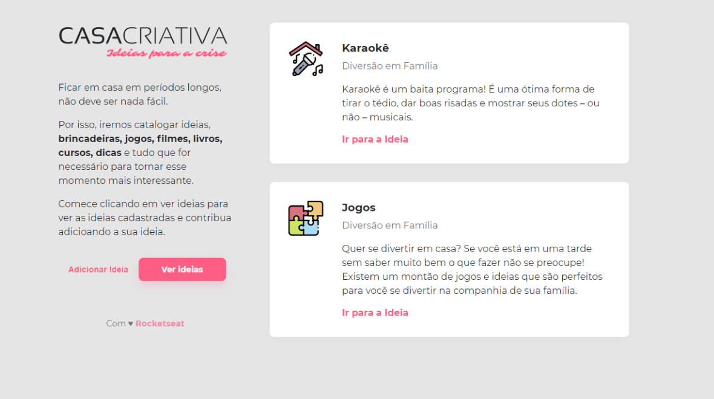
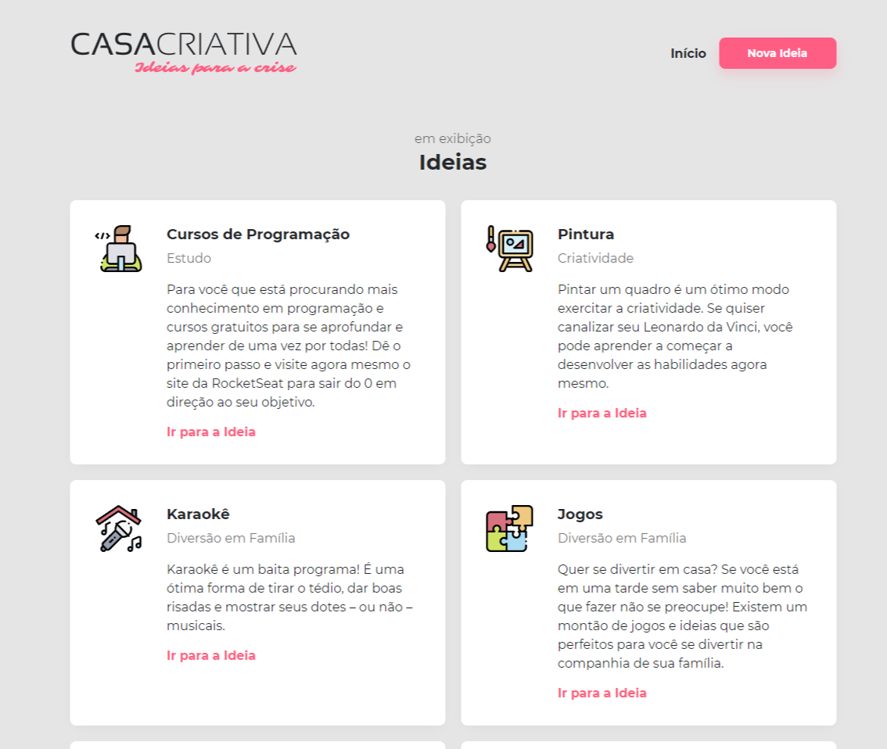
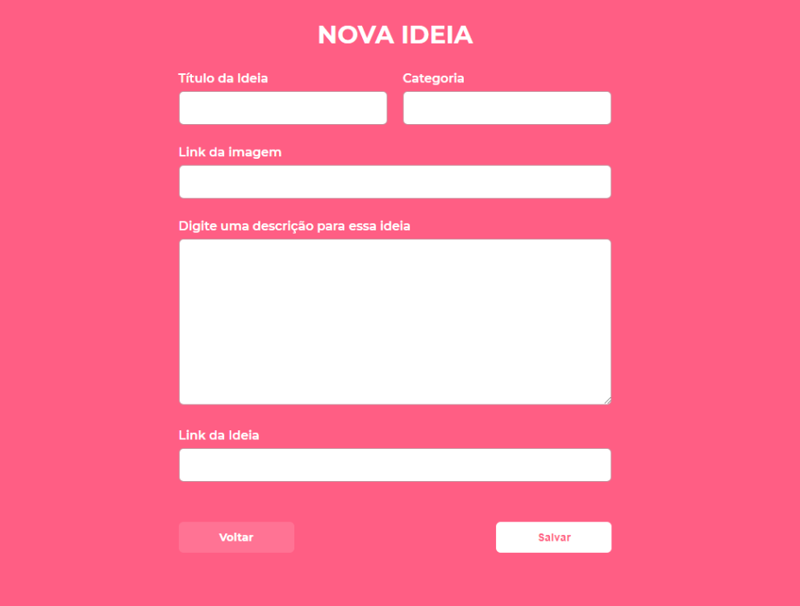

<h1 align="center">
    
</h1>

Um caderninho de anotações de estilo amigável. Perfeito para guardar suas ideias

📌 Sobre o Casa Criativa - Ideias para a crise
------------------
O projeto foi ministrado por Maiky Brito, instrutor da Rocketseat e seu desenvolvimento ocorreu durante a semana OmniStack 11. A aplicação surgiu com o objetivo de ajudar pessoas a poderem ter onde guardar suas ideias de uma maneira amigável e simples. 

🔧 Tecnologias utilizadas:
------------------

- JAVASCRIPT
- HTML5
- CSS3

Obrigado por chegar até aqui! Este projeto foi feito com muito ❤
